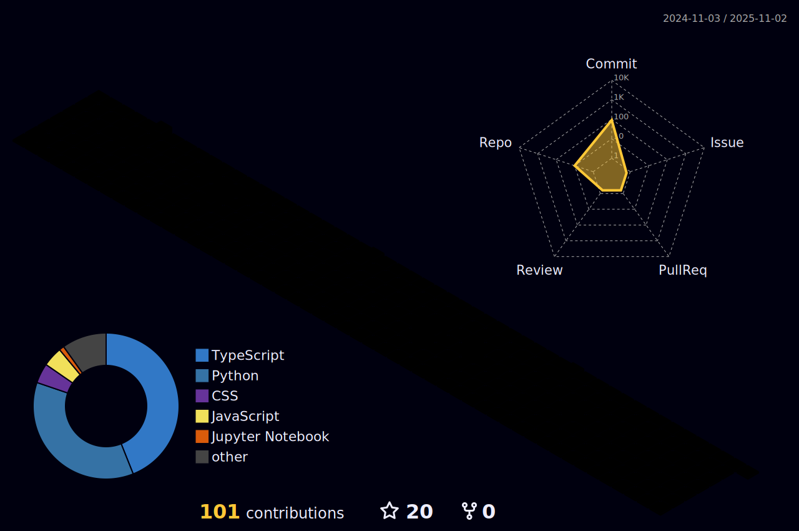

<div align="center">
  
# 👋 Welcome to Sandeep Gudisa's Tech Universe!
[](https://git.io/typing-svg)

</div>

## 🚀 About Me
```python
class SandeepGudisa:
    def __init__(self):
        self.role = "AI/ML Developer"
        self.languages = ["Python", "JavaScript", "C++"]
        self.interests = ["Deep Learning", "Computer Vision", "NLP", "Generative AI"]
        self.current_focus = "Building AI-powered Universal Translator"
        
    def say_hi(self):
        print("Thanks for dropping by! Let's build something amazing together.")
```

## 💻 Tech Arsenal
<details>
<summary>Click to expand!</summary>

### Languages & Frameworks


### Tools & Platforms


</details>

## 📊 Contribution Timeline
<!-- Contribution Timeline Section -->
<div align="center">
  


[](https://github.com/GudisaSandeep)

</div>

## 🌟 Dynamic Stats Dashboard
<div align="center">
  
<!-- GitHub Stats Cards with Animations -->


<div style="display: flex; justify-content: space-between; margin-top: 20px;">
  
  
</div>

<!-- 3D Contribution Calendar -->


</div>

## 🏆 Achievements & Metrics
<details>
<summary>Expand to see more!</summary>

### GitHub Trophies


### Contribution Streak
[](https://git.io/streak-stats)

</details>

## 🎯 Current Projects
```javascript
const currentProjects = {
    mainProject: "AI Universal Translator",
    technologies: ["Transformer Models", "Speech Recognition", "NLP"],
    status: "In Development 🚧",
    completion: "75%"
};
```

## 📚 Latest Blog Posts
<!-- BLOG-POST-LIST:START -->
- [Building Cutting-Edge AI Solutions](https://yourdomain.com/blog1)
- [Deep Learning in Computer Vision](https://yourdomain.com/blog2)
- [The Future of Generative AI](https://yourdomain.com/blog3)
<!-- BLOG-POST-LIST:END -->

## 🤝 Let's Connect!
<div align="center">
  
[](https://linkedin.com/in/sandeep-gudisa)
[](https://www.youtube.com/@AIProgrammingTelugu)
[](https://your-portfolio.com)

</div>

## 📈 Visitor Count
<div align="center">
  

  
</div>

---
<div align="center">
  
### 💭 Random Dev Quote


### 🎮 When I'm Not Coding...
```text
🎯 Working on side projects
📚 Learning new technologies
🎥 Creating tech content
🌱 Contributing to open source
```
</div>
